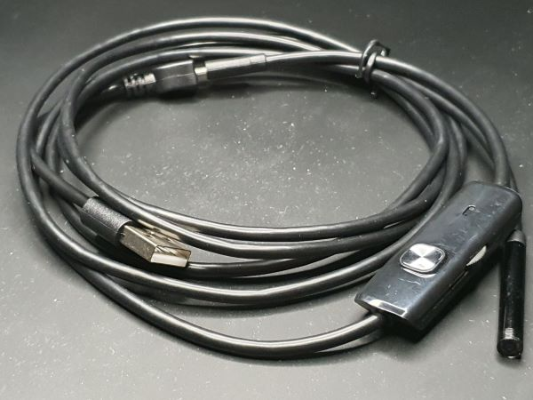
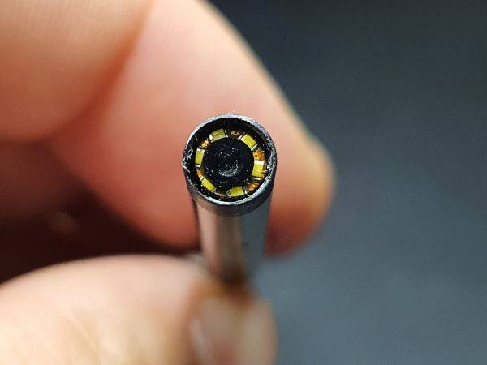
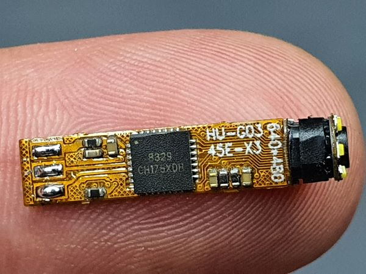
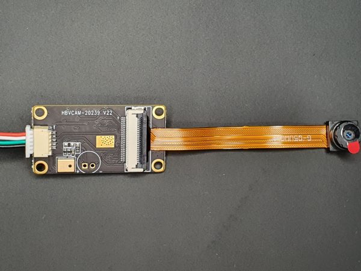
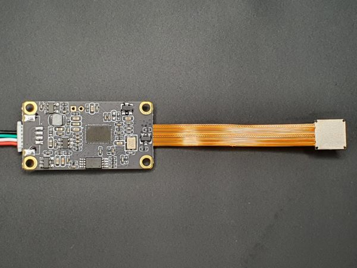
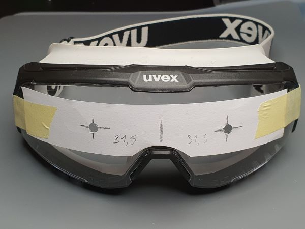
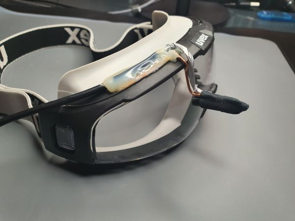
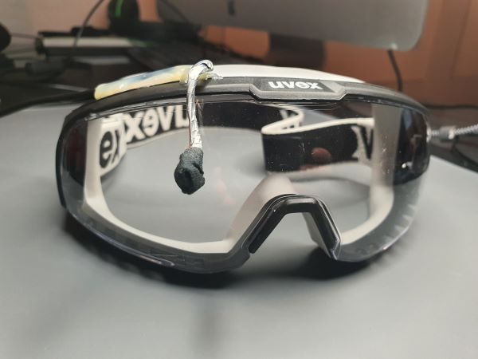

# Modalitati de a urmari miscarea ochilor

Eye tracking (urmarirea privirii) este tehnica prin care se măsoară mișcările ochilor și punctele de focalizare ale unei persoane. Există mai multe metode și tehnologii pentru aceasta, variind de la simple la complexe.
Documentarea procesului de reaserch cu fotografii, link-uri si descriere

## Webcam-based Eye Tracking:

 Folosește software specializat care analizează imagini de la o cameră web standard pentru a estima unde privește utilizatorul. Exemple includ aplicații software precum "GazePointer".

  ### Eyetrackvr, realizat cu esp32-IR-WindowsSoftware-Unity

  * Trebuie scos filtrul IR de la modulele de camera
  * Atentie la puterea diodelor IR!!! Pe site sunt cateva documente despre impactul radiatiei IR asupra ochiului
  * <https://docs.eyetrackvr.dev/getting_started/intro>

  *  <https://github.com/EyeTrackVR/OpenIris>

  * <https://www.youtube.com/watch?v=QYH-FWvDbDc>
  * <https://www.youtube.com/watch?v=4tH95X1_7Zc> 

 --- 

## USB Camera cu OpenCV:
 Si aceasta varianta ne-ar da posibilitatea de a monta camera video la un singur ochi, implicit mai putin hardware ce se monteaza pe sapca, ochelari.
 
 [Link]https://medium.com/@stepanfilonov/tracking-your-eyes-with-python-3952e66194a6

 --- 

## Eye Tracking cu IR montate pe ochelari:
Posibil cea mai ieftina metoda dar inca nu stiu cat de eficiienta este.

 [Link]https://people.ece.cornell.edu/land/courses/ece4760/FinalProjects/s2010/yh428_aoo34/eyetracking/

 [Link]https://people.ece.cornell.edu/land/courses/ece4760/FinalProjects/f2013/msw234_sf323/msw234_sf323_old/msw234_sf323/Eyetracker.htm

 --- 

## Sisteme Standalone de Eye Tracking:
 Acestea sunt dispozitive specializate care sunt montate pe un monitor sau o pereche de ochelari. Ele folosesc surse de lumină infraroșie și camere pentru a urmări mișcarea ochilor. Exemple includ produse de la Tobii sau EyeTribe.
  [Link]https://www.tobii.com/products/eye-trackers

  [Link]https://theeyetribe.com/dev.theeyetribe.com/dev.theeyetribe.com/general/index.html

  [Link]https://pupil-labs.com/products/core/

  [Link]https://imotions.com/products/hardware/eye-tracking/eye-tracking-glasses/

 --- 

## Eye Tracking în Realitate Virtuală (VR):
 
 Multe căști de realitate virtuală sunt echipate sau pot fi adaptate cu tehnologie de eye tracking, cum ar fi HTC Vive Pro Eye.

 --- 

## Electrooculografie (EOG):
 
 O metodă care implică plasarea de electrozi în jurul ochilor pentru a măsura potențialele electrice care apar odată cu mișcarea globilor oculari.
 
  [Link]https://en.wikipedia.org/wiki/Electrooculography

 --- 

## Eye Tracking Combinat cu Analiza EEG
 (Electroencefalografie): Unele sisteme avansate combină eye tracking-ul cu analiza EEG pentru a obține și mai multe informații despre atenția și răspunsul neurologic al utilizatorului.

 <https://www.reginamaria.ro/articole-medicale/sa-intelegem-ce-este-electroencefalograma>

 --- 

# Camere testate:
## Endoscop Cam
 
|                                                  |                                                   |                                                   |
|--------------------------------------------------|---------------------------------------------------|---------------------------------------------------|
|  |  |  |

 Technische Parameter

    Auflösung: 640x480 px / 1024x720 px
    Aufnahme: 30 Videobilder/Sekunde
    Wasserdichtigkeit: IP67
    Durchmesser der Kamera: 5,5 mm
    Kabellänge: 1m
    Betrachtungswinkel: 67
    Schnittstelle: USB 2.0, microUSB, USB-C
    Betriebstemperatur: -10°C - 120°C
    Kabeltyp: Weich
    6 einstellbare weiße LEDs
### 10 Euro
 <https://www.amazon.de/dp/B09FPST6HG?psc=1&ref=ppx_yo2ov_dt_b_product_details>
 
  --- 

## USB Cam

|                                             |                                              |
|---------------------------------------------|----------------------------------------------|
|  |  |

Overview:

This mini usb camera module adopts CMOS image sensor OV5640 produced by OmniVision Technologies, high-definition camera has 5 Megapixel,
adopts USB2.0 interface, weights only 10g, adopts fixed focus mode, with microphone, supports Win XP/Win7/Win8/vista/mac/Linux/Android 4.0/Jetson Nano operating system.

Specifications:

Size: 85.8mm(Length)x18mm(Width)x6mm(High)±0.2mm
Temperature(Operating): -30℃～70℃
Temperature(Stable Image): 0℃～50℃
Assembly Technique: SMT(ROSH)
Focus: Fixed
Object Distance: 30CM～infinity
Resolution: 600LW/PH(Center)
Interface: USB2.0
Power Supply: USB bus power
Supply Voltage: DC 5V±5%
Maximum Power Consumption: 920mW
Operating System Request: Win XP/Win7/Win8/vista/mac/Linux/Android 4.0/Jetson Nano
Sensor: OV5640 (1/4")
Sensor Package: CSP，Bare Die
Maximum resolution: 2592 x 1944
Sensitivity: 600mv/(lux-sec)
Pixel Size: 1.4µm x 1.4µm

Maximum Image Transfer Rate:
MJPEG 1024x768 30FPS /YUY2 160x120 30FPS
MJPEG 1280x720 30FPS /YUY2 320x240 30FPS
MJPEG 1600x1200 30FPS / YUY2 640x480 30FPS
MJPEG 1920x1080 15FPS /YUY2 800x600 30FPS
MJPEG 2048x1536 15FPS /YUY2 1024x768 15FPS
MJPEG 2592x1944 15FPS /YUY2 2592x1944 3FPS

S/N Ratio: 36db
Max Dynamic Range: 68db
Shutter type: Electronic rolling shutter
AGC/AEC/Whiter Balance: Auto
Output Formats: YUY2/MJPEG
Microphone: Support
Lens Construction: 4P
F/No: 2.8
EFL: 3.3mm
FOV: 60°
Relative Illumination(Sensor): 70%
IR Filter: 650±10nm

### 29.20 Euro
   <https://www.amazon.de/dp/B0C3QWYDSP?psc=1&ref=ppx_yo2ov_dt_b_product_details>

   --- 

## Pi Zero Cam

Modell: HBV-ZERO-V3.0
Stromversorgung: DC3.3V
Kabellänge: Ca. 30 cm
Sensorpixel: 1080P
Lichtempfindlicher Chip: OV5647
Brennweite: 3,51 mm
CMOS-Größe: 1/4 Zoll
Diagonales Sichtfeld: 69,1 Grad
Sensortyp: CMOS
Die höchste Auflösung: 2592 x 1944
Fokusmethode: Manueller Fokus
Notwendigkeit zu fahren: Free Drive
Schnittstelle: CSI
Systemunterstützung: für Raspberry Pi System
Bildrate: 30 fps 

### 20.23 Euro

<https://www.amazon.de/dp/B08QN9GDDC?psc=1&ref=ppx_yo2ov_dt_b_product_details>

## USB Webcam

    Are imaginea cea mai buna dar nu prea se potriveste din cauza marimii. Au mai fost si alte webcam-uri ce am probat dar nu sunt bune pentru scopul propus

 --- 

# Front camera -primul test
 Am testat mai multe camere, ce am gasit in format mai mic. Din cele cu distanta focala mica, endoscope camera, incep sa focalizeze de la 3-4 cm. Chiar daca cei mai multi pozitioneaza camera in partea dreapta jos, pentru primele teste am sa o montez in fata ochiului drept pentru a se potrivi si cu tutorialele vazute pe net.
 ### avantaj cu camera montata in centru
  + Facand teste am vazut ca atunci cand este pozitionata frontal, chiar in fata irisului si aprinsa lumina pe camera, reflecta exact pe mijloc si cred ca este mai usor de scris un program care sa citeasca ca si punct de referinta.
  + lasa in portea de jos loc liber pentru alte sisteme de citire a ochilor, in cazul acesta Tobii. Oricum, si camera care se monteaza in partea de jos, poate fi pozitionata mai inspre deapta
  + sunt mai putine reflexii din lentila ochelarilor decat atunci cand camera e indreptata inspre ochi dintr-o parte
  + exemple cu OpenCV aveau majoritatea camera pozitionata central.
### dezavantaje
 - Este vizibila chiar si cu celalalt ochi.
 - Inestetic
 - Tot sunt reflexii in lentila ochelarilor. Chiar ledurile aflate pe camera sunt aproape neutilizabile(sunt necesare teste)

|                                                     |                                                     |                                                      |
|-----------------------------------------------------|-----------------------------------------------------|------------------------------------------------------|
|  |  |  |

